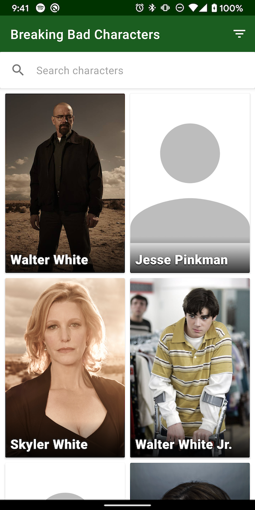
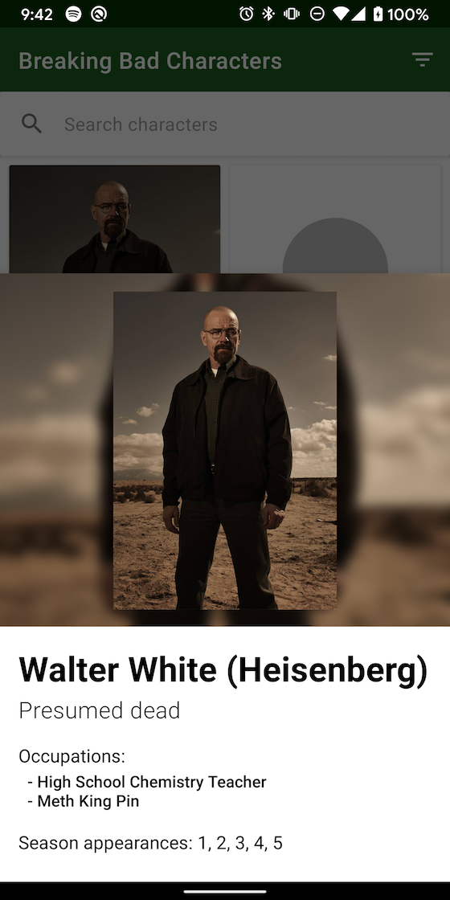

# GanAndroidTest
Coding test for GAN Android Role

List             |  Detail
:-------------------------:|:-------------------------:
  |  

First off - love the Breaking Bad theme. Made me want to rewatch it.

### Quick overview of UI
- Used a Grid Recycler View to show characters and names.
- Used a search bar in the AppBarLayout for searching characters and a menu filter button to launch a season filter dialog.
- Used a `BottomSheetFragment` for showing character details.

### Quicker overview of Architecture & dependencies
- MVVM/MVI Mix. I like having a single `State` object for my UI state and a separate `LiveData<Command>` for issuing commands to the UI.
- Used architecture components LiveData + ViewModel + Kotlin coroutines
- Used Koin for simple DI. 
- Used Retrofit for networking.
- Used kotlinx Serialization for JSON.
- Used Coil for image loading and transformations

The test was open ended so I think I spent a bit more time on it than I would usually on similar tests. It's the first one I've done that doesn't provide a UI
design or starting code up front. 

I've left my full commit history so you can see how I approached the task. I was most unsure about the UI so I did it first with some mock data in place in 
order to get a feel for it. The test says that there should be two screens but I felt that using a Bottom Sheet dialog would be a nicer way to show the 
character details here so I went with that - the data really isn't enough to warrant a whole second screen.

Once the UI was more or less done I started on the architecture. Originally, I was thinking of using RxJava, as I'm comfortable with it but I thought this
would be a nice opportunity to dive into using Kotlin coroutines with Retrofit so I switched to that. The solution could be improved in places but I'm quite happy
with how they handle. Would definitely considering using them more in the future. 
They require a bit of testing boilerplate but you write it once and then forget about it. Mockk as a mocking/verification test library works very nicely with them.

I've unit tested the `BrowserViewModel`. I prefer my views to be dumb with as much logic as possible in the ViewModel.
